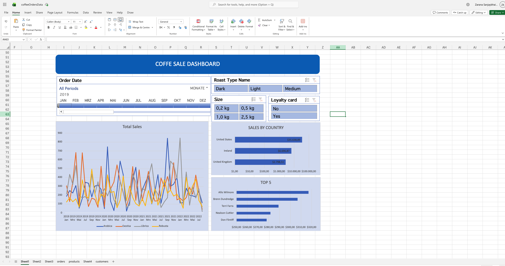
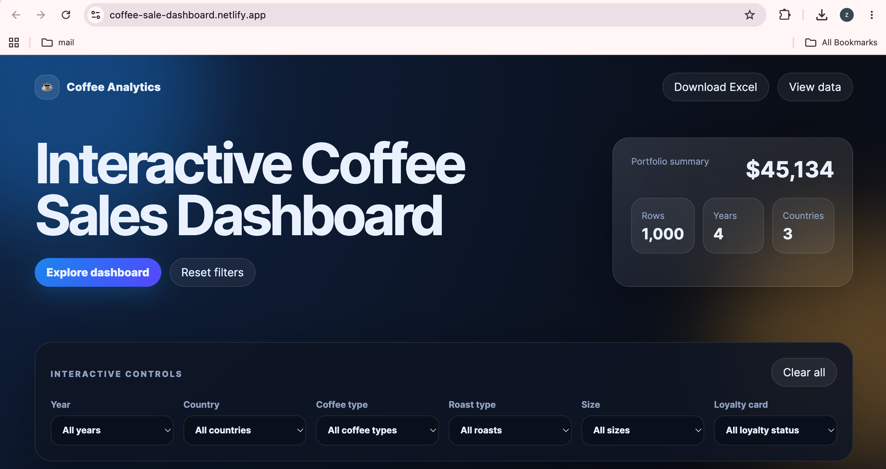

# Interactive Coffee Sales Dashboard

An interactive coffee sales analytics dashboard created from an Excel portfolio project and converted into a responsive web-based dashboard.

This project demonstrates how raw order data can be cleaned, enriched, analyzed, visualized, and presented in a recruiter-friendly portfolio format.

## Live Demo
Live website link : coffee-sale-dashboard.netlify.app

## Project Preview

### Excel Dashboard

### Web Dashboard

## Project Objective

The goal of this project was to analyze coffee sales data and create a clean, interactive dashboard that helps users explore sales performance by year, country, coffee type, roast type, size, and loyalty card status.

The project started in Excel using data cleaning, XLOOKUP formulas, PivotTables, PivotCharts, slicers, and timeline filters. It was later converted into an interactive web dashboard using HTML, CSS, JavaScript, and Chart.js.

## Tools and Technologies Used

* Microsoft Excel
* XLOOKUP
* IF formulas
* PivotTables
* PivotCharts
* Slicers and timeline filters
* HTML
* CSS
* JavaScript
* Chart.js
* GitHub Pages / Netlify for deployment

## Dataset Overview

The workbook contains coffee order data with related customer and product information.

Main fields used in the dashboard include:

* Order Date
* Customer Name
* Email
* Country
* Coffee Type
* Roast Type
* Size
* Unit Price
* Sales
* Profit
* Quantity
* Loyalty Card

## Data Cleaning and Preparation Steps

The project started with the main `orders` table in Excel. Several columns were initially empty and needed to be filled using lookup formulas.

Empty columns included:

* Customer Name
* Email
* Country
* Coffee Type
* Roast Type
* Size
* Unit Price
* Sales

### 1. Filled missing customer and product information

I used the `XLOOKUP` function to bring related data from customer and product tables into the main orders table.

Examples of information added using lookup logic:

* Customer name
* Email
* Country
* Coffee type
* Roast type
* Size
* Unit price

### 2. Cleaned email values

Some lookup results returned `0` when email information was missing. I used an `IF` condition to replace unwanted `0` values with a cleaner blank value.

This made the dataset more readable and avoided incorrect values in the dashboard.

### 3. Converted short values into readable names

Some values were stored in short form, so I converted them into full readable names.

Examples:

* Coffee type codes were converted into full coffee type names.
* Roast type codes were converted into full roast type names.

This improved the readability of PivotTables, charts, slicers, and the final dashboard.

### 4. Formatted date values

The order date column was cleaned and formatted properly so it could be used for time-based analysis.

This allowed the dashboard to show sales trends by year and month.

### 5. Formatted size values

The size column was formatted using kilograms so product sizes could be displayed clearly.

Example:

* `0.2 kg`
* `0.5 kg`
* `1.0 kg`
* `2.5 kg`

### 6. Applied currency formatting

The unit price, sales, and profit columns were formatted with a dollar sign to make the financial values easier to understand.

### 7. Checked duplicate values

I checked the dataset for duplicate records. No duplicate values were found.

### 8. Created an Excel table

After cleaning the data, I converted the final range into an Excel table.

This made it easier to:

* Manage the dataset
* Apply filters
* Extend formulas automatically
* Build PivotTables from a structured source

### 9. Built PivotTables

I created PivotTables to summarize the cleaned data and analyze sales performance from different perspectives.

Examples of analysis:

* Sales over time
* Sales by country
* Sales by coffee type
* Sales by customer
* Sales by roast type
* Sales by package size

### 10. Created PivotCharts and dashboard visuals

I used PivotCharts to create visual insights from the PivotTables.

The Excel dashboard included:

* Sales trend chart
* Sales by country
* Top customers
* Coffee type analysis
* KPI cards
* Slicers
* Timeline filter

### 11. Converted the Excel dashboard into a web dashboard

After completing the Excel dashboard, I converted the project into an interactive web version.

The web dashboard includes:

* Dynamic filters
* KPI cards
* Interactive charts
* Responsive layout
* Data table
* Download filtered CSV option

## Dashboard Features

The web dashboard allows users to filter and explore the data by:

* Year
* Country
* Coffee type
* Roast type
* Size
* Loyalty card status

Main dashboard visuals include:

* Total sales
* Total profit
* Orders
* Units sold
* Average order line
* Top country
* Sales over time
* Top 5 customers
* Sales by country

## Key Insights

Some business questions answered by this dashboard:

* Which country generated the highest sales?
* Which customers contributed the most revenue?
* How did coffee sales change over time?
* Which coffee types performed best?
* How do product size and roast type affect sales?

## How to Run This Project Locally

1. Download or clone this repository.
2. Open the project folder.
3. Open `index.html` in a browser.
4. Use the dashboard filters to explore the data.

## Project Type

This is a portfolio project created to demonstrate Excel analytics, dashboard design, and web-based data visualization skills.
